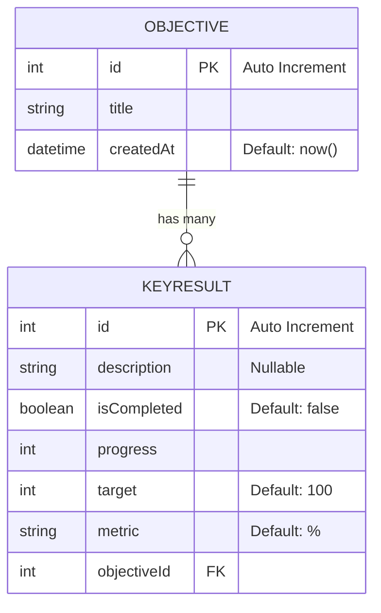

```mermaid
erDiagram
    OBJECTIVE {
        int id PK "Auto Increment"
        string title
        datetime createdAt "Default: now()"
    }

    KEYRESULT {
        int id PK "Auto Increment"
        string description "Nullable"
        boolean isCompleted "Default: false"
        int progress
        int target "Default: 100"
        string metric "Default: %"
        int objectiveId FK
    }

    OBJECTIVE ||--o{ KEYRESULT : "has many"

```